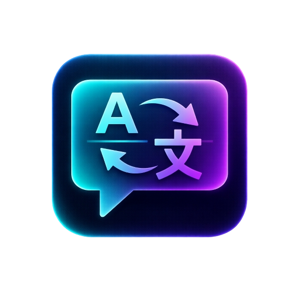

<p align="center">
  
</p>

<h1 align="center">🎮 ChwiliTranslate</h1>

<p align="center">
  <strong>Oyunlar ve Masaüstü Uygulamaları için Gerçek Zamanlı OCR & Çeviri</strong>
</p>

<p align="center">
  
  
  
  
</p>

<p align="center">
  
  
  
</p>

---

## 📋 İçindekiler

- [Hakkında](#-hakkında)
- [Özellikler](#-özellikler)
- [Ekran Görüntüleri](#-ekran-görüntüleri)
- [Kurulum](#-kurulum)
- [Kullanım](#-kullanım)
- [Klavye Kısayolları](#️-klavye-kısayolları)
- [Çeviri Motorları](#-çeviri-motorları)
- [Ayarlar](#️-ayarlar)
- [SSS](#-sık-sorulan-sorular)
- [Proje Yapısı](#-proje-yapısı)
- [Katkıda Bulunma](#-katkıda-bulunma)
- [Lisans](#-lisans)

---

## 🎯 Hakkında

**ChwiliTranslate**, ekrandaki metinleri **gerçek zamanlı OCR** (Optik Karakter Tanıma) ile algılayıp **anında çeviren** modern bir masaüstü uygulamasıdır.

### Kimler İçin?

- 🎮 **Oyuncular** - Japonca/Çince/Korece oyunları Türkçe oynayın
- 📖 **Visual Novel Okuyucuları** - Çevrilmemiş VN'leri keşfedin
- 💼 **Profesyoneller** - Yabancı dildeki dökümanları anında çevirin
- 🌍 **Dil Öğrenenler** - Gerçek zamanlı çeviri ile pratik yapın

### Neden ChwiliTranslate?

| Özellik | ChwiliTranslate | Diğerleri |
|---------|-----------------|-----------|
| Ücretsiz Google Translate | ✅ | ❌ API Key gerekli |
| GPU Hızlandırma | ✅ CUDA | Çoğunda yok |
| Click-through Overlay | ✅ | Sınırlı |
| Özelleştirilebilir Kısayollar | ✅ | Sabit |
| Modern UI | ✅ Glassmorphism | Eski tasarım |
| Akıllı Cache | ✅ | Yok |

---

## ✨ Özellikler

### 🔍 OCR (Metin Tanıma)
- **EasyOCR** altyapısı ile yüksek doğruluk
- **GPU (CUDA)** hızlandırma desteği
- **50+ dil** desteği (Japonca, Çince, Korece, İngilizce vb.)
- **3 hız modu**: Fast, Normal, Accurate
- Ayarlanabilir doğruluk eşiği

### 🌐 Çeviri
- **4 çeviri motoru**: Google (Ücretsiz!), ChatGPT, Gemini, DeepL
- Otomatik kaynak dil algılama
- 100+ hedef dil
- **Akıllı cache** - Aynı metni tekrar çevirmez

### 🎨 Overlay (Oyun İçi Pencere)
- **Click-through** - Oyunu etkilemez
- Sürükle-bırak ile konum ayarlama
- Özelleştirilebilir:
  - Yazı boyutu ve fontu
  - Yazı rengi ve arka plan rengi
  - Opaklık (şeffaflık)
  - Glow efekti
  - Blur arka plan
  - Kalın/İtalik yazı

### ⌨️ Kısayollar
- Tamamen özelleştirilebilir
- Global hotkey desteği (F9)
- Hızlı erişim tuşları

### 🖥️ Sistem
- **Sistem tepsisi** desteği
- F9 ile gizle/göster
- Otomatik ayar kaydetme
- Hariç tutulan alan desteği

---

## � Ekrran Görüntüleri

### Ana Sayfa
```
┌─────────────────────────────────────────────────────────────┐
│  🎮  │         ChwiliTranslate                              │
├──────┤         Gerçek Zamanlı Ekran OCR ve Çeviri           │
│  🏠  │                                                      │
│  📷  │  ┌─────────────────────────────────────────────────┐ │
│  🌐  │  │ ● OCR Inactive │ FPS: 0.0 │ GPU: ✓ │ ▶ START  │ │
│  💬  │  └─────────────────────────────────────────────────┘ │
│  ⚙️  │                                                      │
│  ⌨️  │  ┌──────────┐ ┌──────────┐ ┌──────────┐            │
│      │  │ 📷 OCR   │ │ 🌐 Çeviri│ │ 💾 Cache │            │
│      │  │ Hazır    │ │ Google   │ │ 42 kayıt │            │
│      │  └──────────┘ └──────────┘ └──────────┘            │
└─────────────────────────────────────────────────────────────┘
```

### Sekmeler

| Sekme | Açıklama |
|-------|----------|
| 🏠 **Ana Sayfa** | Dashboard, durum kartları, START/STOP |
| 📷 **OCR Control** | Bölge seçimi, hız ayarları, canlı önizleme |
| 🌐 **Translation** | Çeviri motoru, API anahtarları, dil seçimi |
| 💬 **Overlay** | Görünüm ayarları, renkler, efektler |
| ⚙️ **Ayarlar** | Cache, hariç tutulan alanlar |
| ⌨️ **Kısayollar** | Klavye kısayolları yönetimi |

---

## �️ Kurulum

### Gereksinimler

| Gereksinim | Minimum | Önerilen |
|------------|---------|----------|
| İşletim Sistemi | Windows 10 | Windows 11 |
| Python | 3.10 | **3.12** (GPU için) |
| RAM | 4 GB | 8 GB+ |
| GPU | - | NVIDIA (CUDA 12.1) |

### Adım Adım Kurulum

#### 1. Python Kurulumu
[Python 3.12](https://www.python.org/downloads/) indirip kurun.

> ⚠️ Kurulum sırasında **"Add Python to PATH"** seçeneğini işaretleyin!
> 
> ⚠️ **GPU kullanmak istiyorsanız Python 3.12 kullanın!** Python 3.13+ için CUDA destekli PyTorch henüz mevcut değil.

#### 2. Projeyi İndirin
```bash
# Git ile
git clone https://github.com/kullaniciadi/ChwiliTranslate.git
cd ChwiliTranslate

# veya ZIP olarak indirip çıkartın
```

#### 3. GPU Desteği ile Kurulum (Önerilen)

NVIDIA GPU'nuz varsa (GTX 10xx ve üzeri):

```bash
# Önce PyTorch CUDA 12.1 versiyonunu yükleyin
pip install torch torchvision --index-url https://download.pytorch.org/whl/cu121

# Sonra diğer bağımlılıkları yükleyin
pip install -r requirements.txt
```

#### 3b. CPU ile Kurulum (GPU yoksa)

```bash
pip install -r requirements.txt
```

#### 4. Uygulamayı Başlatın
```bash
python main.py
```

veya `run.bat` dosyasına çift tıklayın.

### GPU Kontrolü

Uygulamayı başlattığınızda status bar'da:
- **GPU Active** → CUDA çalışıyor ✅
- **CPU Mode** → GPU bulunamadı, CPU kullanılıyor

---

## 📖 Kullanım

### Hızlı Başlangıç

1. **Uygulamayı başlatın**
   ```bash
   python main.py
   ```

2. **Bölge seçin**
   - 📷 OCR Control sekmesine gidin
   - "Bölge Seç" butonuna tıklayın
   - Fare ile çevirmek istediğiniz alanı seçin

3. **Çeviri motorunu seçin**
   - 🌐 Translation sekmesine gidin
   - Google Translate (ücretsiz) veya diğer motorları seçin
   - Gerekirse API anahtarını girin

4. **Başlatın!**
   - Ana sayfadaki **START** butonuna basın
   - veya **F8** kısayolunu kullanın

5. **Overlay'i konumlandırın**
   - Çeviri penceresi ekranda görünecek
   - Sürükleyerek istediğiniz yere taşıyın

### İpuçları

- 🎮 **Oyun oynarken**: F9 ile uygulamayı gizleyin, tekrar F9 ile geri getirin
- ⚡ **Hız için**: GPU'yu etkinleştirin ve "Fast" modunu seçin
- 💾 **Cache**: Aynı metinler tekrar çevrilmez, hız kazanırsınız
- 🎨 **Overlay**: Oyuna göre renk ve opaklığı ayarlayın

---

## ⌨️ Klavye Kısayolları

### Varsayılan Kısayollar

| Kısayol | İşlev | Değiştirilebilir |
|---------|-------|------------------|
| **F8** | OCR Başlat / Durdur | ✅ |
| **F9** | Uygulamayı Gizle / Göster | 🔒 Hayır |
| **F10** | OCR Bölgesi Seç | ✅ |
| **F11** | Ayarlar Paneli | ✅ |
| **F12** | Cache Temizle | ✅ |
| **Ctrl+Shift+↑** | Yazı Boyutu Artır | ✅ |
| **Ctrl+Shift+↓** | Yazı Boyutu Azalt | ✅ |
| **Ctrl+Shift+→** | Opaklık Artır | ✅ |
| **Ctrl+Shift+←** | Opaklık Azalt | ✅ |
| **Ctrl+Shift+Q** | Uygulamayı Kapat | ✅ |

> 🔒 F9 global hotkey olduğu için değiştirilemez

### Kısayol Değiştirme

1. ⌨️ Kısayollar sekmesine gidin
2. Değiştirmek istediğiniz kısayola tıklayın
3. Yeni tuş kombinasyonuna basın
4. Otomatik kaydedilir

---

## 🌐 Çeviri Motorları

### Google Translate (Önerilen)
- ✅ **Ücretsiz** - API anahtarı gerektirmez
- ✅ Hızlı
- ✅ 100+ dil desteği
- ⚠️ Günlük limit olabilir

### ChatGPT (OpenAI)
- 💰 Ücretli (API kullanımı)
- ✅ Yüksek kalite çeviri
- ✅ Bağlam anlama
- 🔑 [API Key Al](https://platform.openai.com/api-keys)

### Gemini (Google AI)
- 💰 Ücretsiz tier mevcut
- ✅ Hızlı
- ✅ Güncel model
- 🔑 [API Key Al](https://makersuite.google.com/app/apikey)

### DeepL
- 💰 Ücretli (ücretsiz tier sınırlı)
- ✅ Profesyonel kalite
- ✅ Avrupa dilleri için mükemmel
- 🔑 [API Key Al](https://www.deepl.com/pro-api)

### API Anahtarı Ekleme

1. 🌐 Translation sekmesine gidin
2. İstediğiniz motoru seçin
3. API anahtarını girin
4. "Kaydet" butonuna tıklayın

---

## ⚙️ Ayarlar

### OCR Ayarları

| Ayar | Açıklama | Değerler |
|------|----------|----------|
| Hız Modu | OCR hızı vs doğruluk | Fast / Normal / Accurate |
| Doğruluk Eşiği | Minimum güven skoru | %0 - %100 |
| GPU | CUDA hızlandırma | Açık / Kapalı |

### Overlay Ayarları

| Ayar | Açıklama |
|------|----------|
| Opaklık | Pencere şeffaflığı (0.1 - 1.0) |
| Yazı Boyutu | Font büyüklüğü (8 - 72) |
| Font | Yazı tipi ailesi |
| Yazı Rengi | Metin rengi |
| Arka Plan | Pencere arka plan rengi |
| Glow | Parlama efekti |
| Blur | Bulanık arka plan |
| Kalın/İtalik | Yazı stili |

### Cache Ayarları

- **Cache Aktif**: Çevirileri önbelleğe al
- **Cache Temizle**: Tüm önbelleği sil
- **Önbellek Sayısı**: Kaydedilmiş çeviri sayısı

---

## ❓ Sık Sorulan Sorular

<details>
<summary><b>Uygulama açılmıyor, ne yapmalıyım?</b></summary>

1. Python 3.10+ kurulu mu kontrol edin
2. `pip install -r requirements.txt` çalıştırın
3. Hata mesajını kontrol edin
</details>

<details>
<summary><b>OCR çalışmıyor veya yanlış okuyor</b></summary>

1. Bölge seçimini kontrol edin
2. "Accurate" modunu deneyin
3. Doğruluk eşiğini düşürün
4. Kaynak dili doğru seçtiğinizden emin olun
</details>

<details>
<summary><b>Çeviri çok yavaş</b></summary>

1. GPU'yu etkinleştirin (varsa)
2. "Fast" modunu seçin
3. Cache'in aktif olduğundan emin olun
4. Daha küçük bölge seçin
</details>

<details>
<summary><b>Google Translate çalışmıyor</b></summary>

1. İnternet bağlantınızı kontrol edin
2. Günlük limit aşılmış olabilir, yarın tekrar deneyin
3. Farklı bir çeviri motoru deneyin
</details>

<details>
<summary><b>F9 çalışmıyor</b></summary>

F9 global hotkey'dir ve her zaman çalışmalıdır. Çalışmıyorsa:
1. Uygulamayı yönetici olarak çalıştırın
2. Başka bir uygulama F9'u kullanıyor olabilir
</details>

---

## 🗂️ Proje Yapısı

```
ChwiliTranslate/
├── 📄 main.py                 # Ana giriş noktası
├── 📄 requirements.txt        # Python bağımlılıkları
├── 📄 pytest.ini             # Test konfigürasyonu
├── 📄 LICENSE                # MIT Lisansı
├── 📄 README.md              # Bu dosya
│
├── 📁 src/                   # Kaynak kodlar
│   ├── 📄 app_controller.py  # Ana uygulama kontrolcüsü
│   ├── 📄 __init__.py
│   │
│   ├── 📁 ocr/               # OCR modülü
│   │   ├── 📄 engine.py      # EasyOCR motoru
│   │   └── 📄 region_selector.py
│   │
│   ├── 📁 translate/         # Çeviri modülü
│   │   ├── 📄 engine.py      # Çeviri motoru
│   │   ├── 📄 providers.py   # API sağlayıcıları
│   │   └── 📄 cache.py       # Cache yönetimi
│   │
│   ├── 📁 overlay/           # Overlay modülü
│   │   └── 📄 overlay_window.py
│   │
│   ├── 📁 ui/                # Kullanıcı arayüzü
│   │   ├── 📄 main_window.py
│   │   └── 📁 components/    # UI bileşenleri
│   │
│   └── 📁 utils/             # Yardımcı modüller
│       ├── 📄 config.py      # Konfigürasyon
│       ├── 📄 hotkey_manager.py
│       └── 📄 logger.py
│
├── 📁 assets/                # Statik dosyalar
│   └── 📁 icons/             # Uygulama ikonları
│
└── 📁 tests/                 # Testler
    ├── 📁 unit/
    └── 📁 property/
```

---

## 🧪 Testler

```bash
# Tüm testleri çalıştır
pytest

# Detaylı çıktı
pytest -v

# Belirli test dosyası
pytest tests/property/test_cache_properties.py

# Coverage raporu
pytest --cov=src --cov-report=html
```

---

## 🤝 Katkıda Bulunma

Katkılarınızı bekliyoruz! 🎉

### Nasıl Katkıda Bulunurum?

1. **Fork** yapın
2. Feature branch oluşturun
   ```bash
   git checkout -b feature/yeni-ozellik
   ```
3. Değişikliklerinizi commit edin
   ```bash
   git commit -m "Yeni özellik: XYZ eklendi"
   ```
4. Branch'i push edin
   ```bash
   git push origin feature/yeni-ozellik
   ```
5. **Pull Request** açın

### Katkı Kuralları

- Kod stili: PEP 8
- Commit mesajları: Türkçe veya İngilizce, açıklayıcı
- Test: Yeni özellikler için test yazın
- Dokümantasyon: README'yi güncelleyin

---

## ⚠️ Yasal Uyarı

- Bu proje **eğitim ve kişisel kullanım** amaçlıdır
- Çeviri kalitesi kullanılan servislere bağlıdır
- API kullanımı ilgili servislerin koşullarına tabidir
- Ticari kullanım için ilgili lisansları kontrol edin

---

## 📄 Lisans

Bu proje [MIT Lisansı](LICENSE) ile lisanslanmıştır.

```
MIT License - Özet:
✅ Ticari kullanım
✅ Değiştirme
✅ Dağıtım
✅ Özel kullanım
❌ Sorumluluk
❌ Garanti
```

---

## 🙏 Teşekkürler

- [EasyOCR](https://github.com/JaidedAI/EasyOCR) - OCR motoru
- [PyQt6](https://www.riverbankcomputing.com/software/pyqt/) - GUI framework
- [deep-translator](https://github.com/nidhaloff/deep-translator) - Çeviri API'leri

---

<p align="center">
  <strong>⭐ Beğendiyseniz yıldız vermeyi unutmayın!</strong>
</p>

<p align="center">
  <a href="https://github.com/kullaniciadi/ChwiliTranslate/issues">🐛 Bug Bildir</a>
  •
  <a href="https://github.com/kullaniciadi/ChwiliTranslate/issues">💡 Özellik İste</a>
</p>

<p align="center">
  Made with ❤️ by <strong>Chwili</strong>
</p>
